# Comprehensive UML Diagrams for Service Interface Java 21 Codebase

Based on the detailed documentation provided, I've created a series of UML diagrams to help you understand the structure, behavior, and interactions within the codebase. These diagrams are organized from high-level to detailed implementation aspects.

## 1. High-Level Architecture Diagram

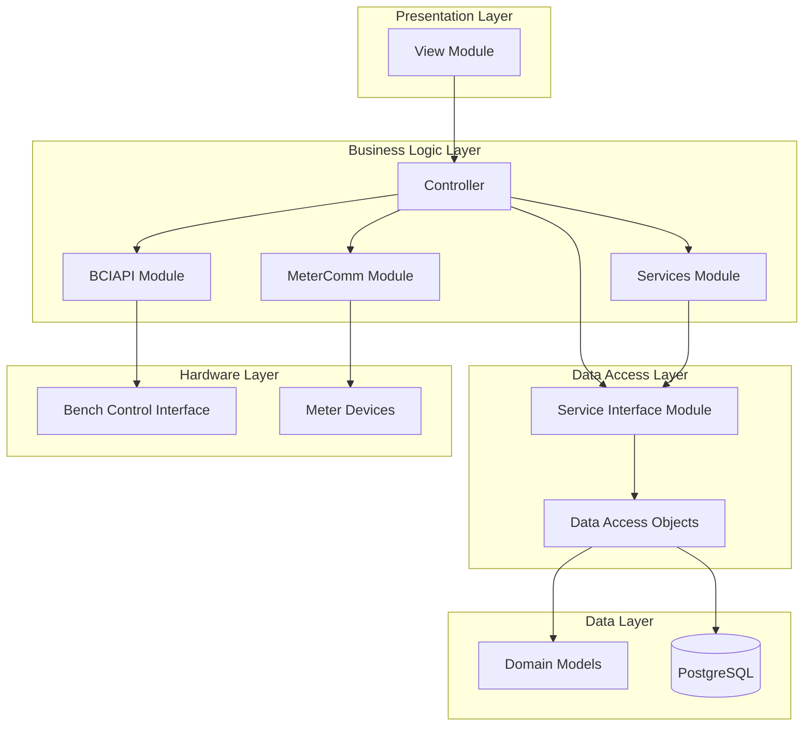
```mermaid
graph TD
    subgraph "Presentation Layer"
        View[View Module]
    end
    
    subgraph "Business Logic Layer"
        Controller[Controller]
        Services[Services Module]
        BCIAPI[BCIAPI Module]
        MeterComm[MeterComm Module]
    end
    
    subgraph "Data Access Layer"
        SI[Service Interface Module]
        DAOs[Data Access Objects]
    end
    
    subgraph "Data Layer"
        Models[Domain Models]
        DB[(PostgreSQL)]
    end
    
    subgraph "Hardware Layer"
        BCI[Bench Control Interface]
        Meters[Meter Devices]
    end
    
    View --> Controller
    Controller --> Services
    Controller --> BCIAPI
    Controller --> MeterComm
    Controller --> SI
    Services --> SI
    BCIAPI --> BCI
    MeterComm --> Meters
    SI --> DAOs
    DAOs --> DB
    DAOs --> Models
```

## 2. Module Relationship Diagram

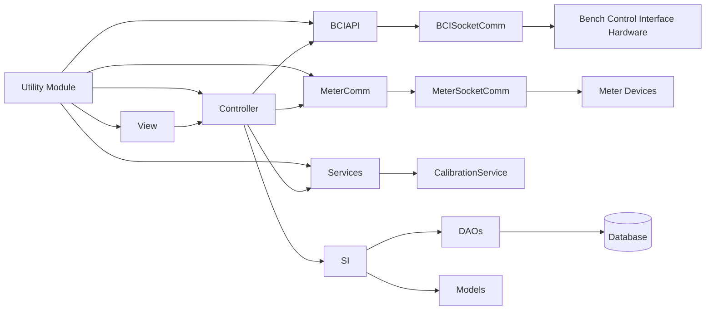
```mermaid
graph LR
    View --> Controller
    Controller --> BCIAPI
    Controller --> MeterComm
    Controller --> Services
    Controller --> SI
    BCIAPI --> BCISocketComm
    MeterComm --> MeterSocketComm
    BCISocketComm --> BCI[Bench Control Interface Hardware]
    MeterSocketComm --> Meters[Meter Devices]
    Services --> CalibrationService
    SI --> DAOs
    Util[Utility Module] --> View
    Util --> Controller
    Util --> BCIAPI
    Util --> MeterComm
    Util --> Services
    SI --> Models
    DAOs --> DB[(Database)]
```

## 3. Class Diagrams

### 3.1 BCIAPI Module Class Diagram

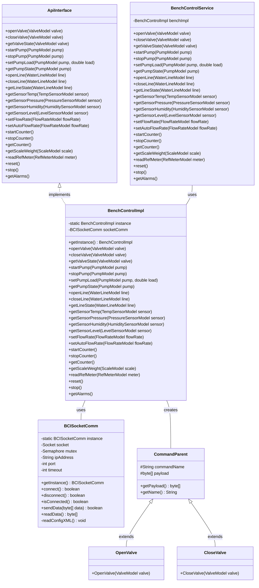
```mermaid
classDiagram
    class ApiInterface {
        +openValve(ValveModel valve)
        +closeValve(ValveModel valve)
        +getValveState(ValveModel valve)
        +startPump(PumpModel pump)
        +stopPump(PumpModel pump)
        +setPumpLoad(PumpModel pump, double load)
        +getPumpState(PumpModel pump)
        +openLine(WaterLineModel line)
        +closeLine(WaterLineModel line)
        +getLineState(WaterLineModel line)
        +getSensorTemp(TempSensorModel sensor)
        +getSensorPressure(PressureSensorModel sensor)
        +getSensorHumidity(HumiditySensorModel sensor)
        +getSensorLevel(LevelSensorModel sensor)
        +setFlowRate(FlowRateModel flowRate)
        +setAutoFlowRate(FlowRateModel flowRate)
        +startCounter()
        +stopCounter()
        +getCounter()
        +getScaleWeight(ScaleModel scale)
        +readRefMeter(RefMeterModel meter)
        +reset()
        +stop()
        +getAlarms()
    }
    
    class BenchControlImpl {
        -static BenchControlImpl instance
        -BCISocketComm socketComm
        +getInstance() BenchControlImpl
        +openValve(ValveModel valve)
        +closeValve(ValveModel valve)
        +getValveState(ValveModel valve)
        +startPump(PumpModel pump)
        +stopPump(PumpModel pump)
        +setPumpLoad(PumpModel pump, double load)
        +getPumpState(PumpModel pump)
        +openLine(WaterLineModel line)
        +closeLine(WaterLineModel line)
        +getLineState(WaterLineModel line)
        +getSensorTemp(TempSensorModel sensor)
        +getSensorPressure(PressureSensorModel sensor)
        +getSensorHumidity(HumiditySensorModel sensor)
        +getSensorLevel(LevelSensorModel sensor)
        +setFlowRate(FlowRateModel flowRate)
        +setAutoFlowRate(FlowRateModel flowRate)
        +startCounter()
        +stopCounter()
        +getCounter()
        +getScaleWeight(ScaleModel scale)
        +readRefMeter(RefMeterModel meter)
        +reset()
        +stop()
        +getAlarms()
    }
    
    class BenchControlService {
        -BenchControlImpl benchImpl
        +openValve(ValveModel valve)
        +closeValve(ValveModel valve)
        +getValveState(ValveModel valve)
        +startPump(PumpModel pump)
        +stopPump(PumpModel pump)
        +setPumpLoad(PumpModel pump, double load)
        +getPumpState(PumpModel pump)
        +openLine(WaterLineModel line)
        +closeLine(WaterLineModel line)
        +getLineState(WaterLineModel line)
        +getSensorTemp(TempSensorModel sensor)
        +getSensorPressure(PressureSensorModel sensor)
        +getSensorHumidity(HumiditySensorModel sensor)
        +getSensorLevel(LevelSensorModel sensor)
        +setFlowRate(FlowRateModel flowRate)
        +setAutoFlowRate(FlowRateModel flowRate)
        +startCounter()
        +stopCounter()
        +getCounter()
        +getScaleWeight(ScaleModel scale)
        +readRefMeter(RefMeterModel meter)
        +reset()
        +stop()
        +getAlarms()
    }
    
    class BCISocketComm {
        -static BCISocketComm instance
        -Socket socket
        -Semaphore mutex
        -String ipAddress
        -int port
        -int timeout
        +getInstance() BCISocketComm
        +connect() boolean
        +disconnect() boolean
        +isConnected() boolean
        +sendData(byte[] data) boolean
        +readData() byte[]
        -readConfigXML() void
    }
    
    class CommandParent {
        #String commandName
        #byte[] payload
        +getPayload() byte[]
        +getName() String
    }
    
    class OpenValve {
        +OpenValve(ValveModel valve)
    }
    
    class CloseValve {
        +CloseValve(ValveModel valve)
    }
    
    ApiInterface <|.. BenchControlImpl : implements
    BenchControlImpl -- BCISocketComm : uses
    BenchControlService -- BenchControlImpl : uses
    CommandParent <|-- OpenValve : extends
    CommandParent <|-- CloseValve : extends
    BenchControlImpl -- CommandParent : creates
```

### 3.2 Service Interface (SI) Module Class Diagram

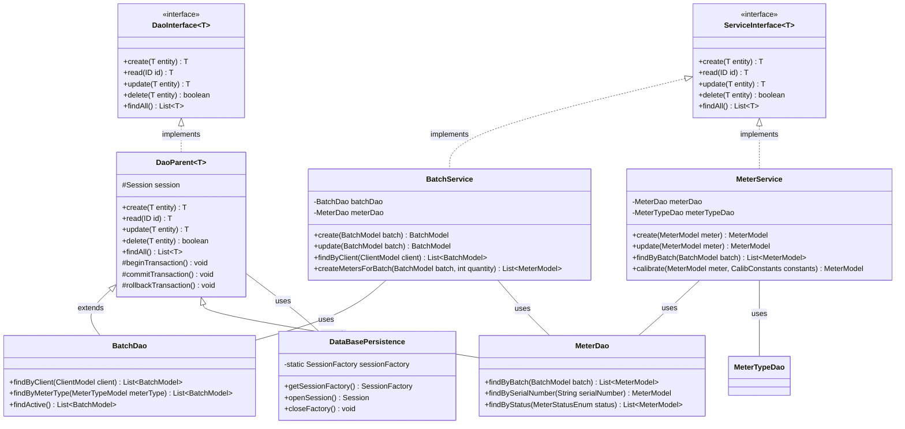
```mermaid
classDiagram
    class DataBasePersistence {
        -static SessionFactory sessionFactory
        +getSessionFactory() SessionFactory
        +openSession() Session
        +closeFactory() void
    }
    
    class DaoInterface~T~ {
        <<interface>>
        +create(T entity) T
        +read(ID id) T
        +update(T entity) T
        +delete(T entity) boolean
        +findAll() List~T~
    }
    
    class DaoParent~T~ {
        #Session session
        +create(T entity) T
        +read(ID id) T
        +update(T entity) T
        +delete(T entity) boolean
        +findAll() List~T~
        #beginTransaction() void
        #commitTransaction() void
        #rollbackTransaction() void
    }
    
    class ServiceInterface~T~ {
        <<interface>>
        +create(T entity) T
        +read(ID id) T
        +update(T entity) T
        +delete(T entity) boolean
        +findAll() List~T~
    }
    
    class BatchDao {
        +findByClient(ClientModel client) List~BatchModel~
        +findByMeterType(MeterTypeModel meterType) List~BatchModel~
        +findActive() List~BatchModel~
    }
    
    class MeterDao {
        +findByBatch(BatchModel batch) List~MeterModel~
        +findBySerialNumber(String serialNumber) MeterModel
        +findByStatus(MeterStatusEnum status) List~MeterModel~
    }
    
    class BatchService {
        -BatchDao batchDao
        -MeterDao meterDao
        +create(BatchModel batch) BatchModel
        +update(BatchModel batch) BatchModel
        +findByClient(ClientModel client) List~BatchModel~
        +createMetersForBatch(BatchModel batch, int quantity) List~MeterModel~
    }
    
    class MeterService {
        -MeterDao meterDao
        -MeterTypeDao meterTypeDao
        +create(MeterModel meter) MeterModel
        +update(MeterModel meter) MeterModel
        +findByBatch(BatchModel batch) List~MeterModel~
        +calibrate(MeterModel meter, CalibConstants constants) MeterModel
    }
    
    DaoInterface <|.. DaoParent : implements
    DaoParent <|-- BatchDao : extends
    DaoParent <|-- MeterDao : extends
    ServiceInterface <|.. BatchService : implements
    ServiceInterface <|.. MeterService : implements
    BatchService -- BatchDao : uses
    BatchService -- MeterDao : uses
    MeterService -- MeterDao : uses
    MeterService -- MeterTypeDao : uses
    DaoParent -- DataBasePersistence : uses
```

### 3.3 Services Module Class Diagram

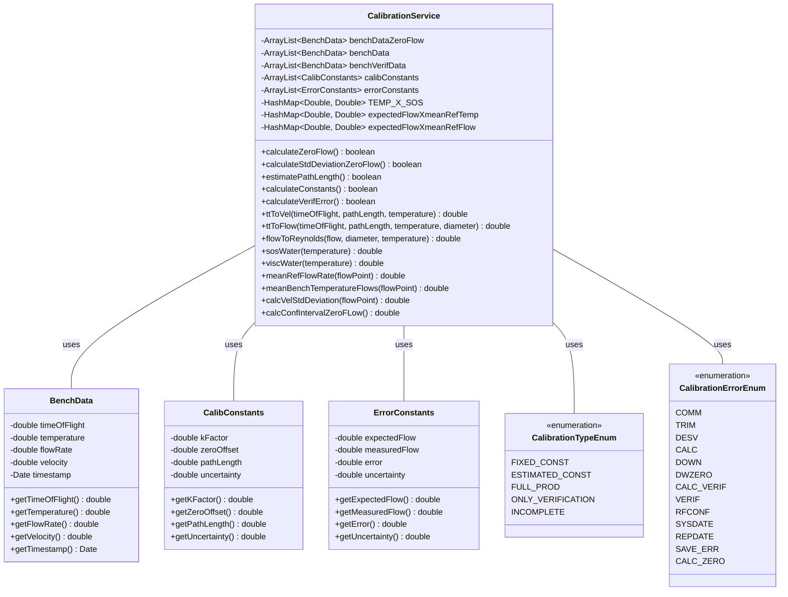
```mermaid
classDiagram
    class CalibrationService {
        -ArrayList~BenchData~ benchDataZeroFlow
        -ArrayList~BenchData~ benchData
        -ArrayList~BenchData~ benchVerifData
        -ArrayList~CalibConstants~ calibConstants
        -ArrayList~ErrorConstants~ errorConstants
        -HashMap~Double, Double~ TEMP_X_SOS
        -HashMap~Double, Double~ expectedFlowXmeanRefTemp
        -HashMap~Double, Double~ expectedFlowXmeanRefFlow
        +calculateZeroFlow() boolean
        +calculateStdDeviationZeroFlow() boolean
        +estimatePathLength() boolean
        +calculateConstants() boolean
        +calculateVerifError() boolean
        +ttToVel(timeOfFlight, pathLength, temperature) double
        +ttToFlow(timeOfFlight, pathLength, temperature, diameter) double
        +flowToReynolds(flow, diameter, temperature) double
        +sosWater(temperature) double
        +viscWater(temperature) double
        +meanRefFlowRate(flowPoint) double
        +meanBenchTemperatureFlows(flowPoint) double
        +calcVelStdDeviation(flowPoint) double
        +calcConfIntervalZeroFLow() double
    }
    
    class CalibrationTypeEnum {
        <<enumeration>>
        FIXED_CONST
        ESTIMATED_CONST
        FULL_PROD
        ONLY_VERIFICATION
        INCOMPLETE
    }
    
    class CalibrationErrorEnum {
        <<enumeration>>
        COMM
        TRIM
        DESV
        CALC
        DOWN
        DWZERO
        CALC_VERIF
        VERIF
        RFCONF
        SYSDATE
        REPDATE
        SAVE_ERR
        CALC_ZERO
    }
    
    class BenchData {
        -double timeOfFlight
        -double temperature
        -double flowRate
        -double velocity
        -Date timestamp
        +getTimeOfFlight() double
        +getTemperature() double
        +getFlowRate() double
        +getVelocity() double
        +getTimestamp() Date
    }
    
    class CalibConstants {
        -double kFactor
        -double zeroOffset
        -double pathLength
        -double uncertainty
        +getKFactor() double
        +getZeroOffset() double
        +getPathLength() double
        +getUncertainty() double
    }
    
    class ErrorConstants {
        -double expectedFlow
        -double measuredFlow
        -double error
        -double uncertainty
        +getExpectedFlow() double
        +getMeasuredFlow() double
        +getError() double
        +getUncertainty() double
    }
    
    CalibrationService -- BenchData : uses
    CalibrationService -- CalibConstants : uses
    CalibrationService -- ErrorConstants : uses
    CalibrationService -- CalibrationTypeEnum : uses
    CalibrationService -- CalibrationErrorEnum : uses
```

### 3.4 MeterComm Socket Class Diagram

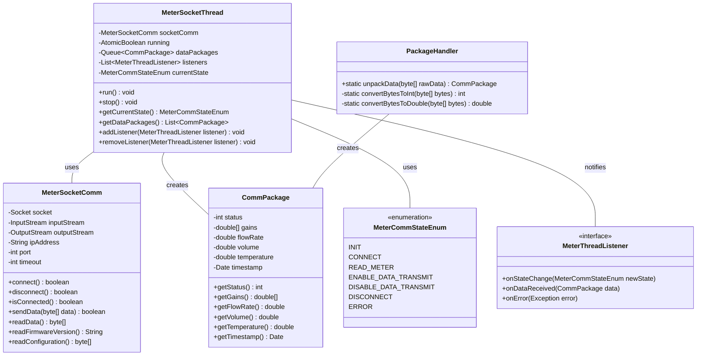
```mermaid
classDiagram
    class MeterSocketComm {
        -Socket socket
        -InputStream inputStream
        -OutputStream outputStream
        -String ipAddress
        -int port
        -int timeout
        +connect() boolean
        +disconnect() boolean
        +isConnected() boolean
        +sendData(byte[] data) boolean
        +readData() byte[]
        +readFirmwareVersion() String
        +readConfiguration() byte[]
    }
    
    class MeterSocketThread {
        -MeterSocketComm socketComm
        -AtomicBoolean running
        -Queue~CommPackage~ dataPackages
        -List~MeterThreadListener~ listeners
        -MeterCommStateEnum currentState
        +run() void
        +stop() void
        +getCurrentState() MeterCommStateEnum
        +getDataPackages() List~CommPackage~
        +addListener(MeterThreadListener listener) void
        +removeListener(MeterThreadListener listener) void
    }
    
    class CommPackage {
        -int status
        -double[] gains
        -double flowRate
        -double volume
        -double temperature
        -Date timestamp
        +getStatus() int
        +getGains() double[]
        +getFlowRate() double
        +getVolume() double
        +getTemperature() double
        +getTimestamp() Date
    }
    
    class PackageHandler {
        +static unpackData(byte[] rawData) CommPackage
        -static convertBytesToInt(byte[] bytes) int
        -static convertBytesToDouble(byte[] bytes) double
    }
    
    class MeterCommStateEnum {
        <<enumeration>>
        INIT
        CONNECT
        READ_METER
        ENABLE_DATA_TRANSMIT
        DISABLE_DATA_TRANSMIT
        DISCONNECT
        ERROR
    }
    
    class MeterThreadListener {
        <<interface>>
        +onStateChange(MeterCommStateEnum newState)
        +onDataReceived(CommPackage data)
        +onError(Exception error)
    }
    
    MeterSocketThread -- MeterSocketComm : uses
    MeterSocketThread -- CommPackage : creates
    MeterSocketThread -- MeterCommStateEnum : uses
    MeterSocketThread -- MeterThreadListener : notifies
    PackageHandler -- CommPackage : creates
```

### 3.5 BCISocketComm Class Diagram

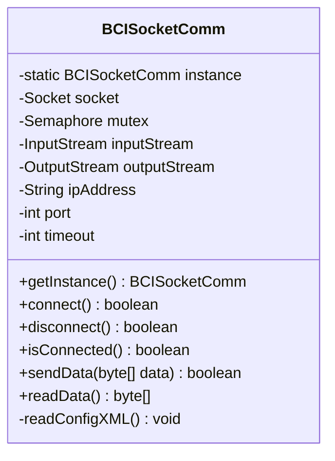
```mermaid
classDiagram
    class BCISocketComm {
        -static BCISocketComm instance
        -Socket socket
        -Semaphore mutex
        -InputStream inputStream
        -OutputStream outputStream
        -String ipAddress
        -int port
        -int timeout
        +getInstance() BCISocketComm
        +connect() boolean
        +disconnect() boolean
        +isConnected() boolean
        +sendData(byte[] data) boolean
        +readData() byte[]
        -readConfigXML() void
    }
```

### 3.6 View Module Class Diagram

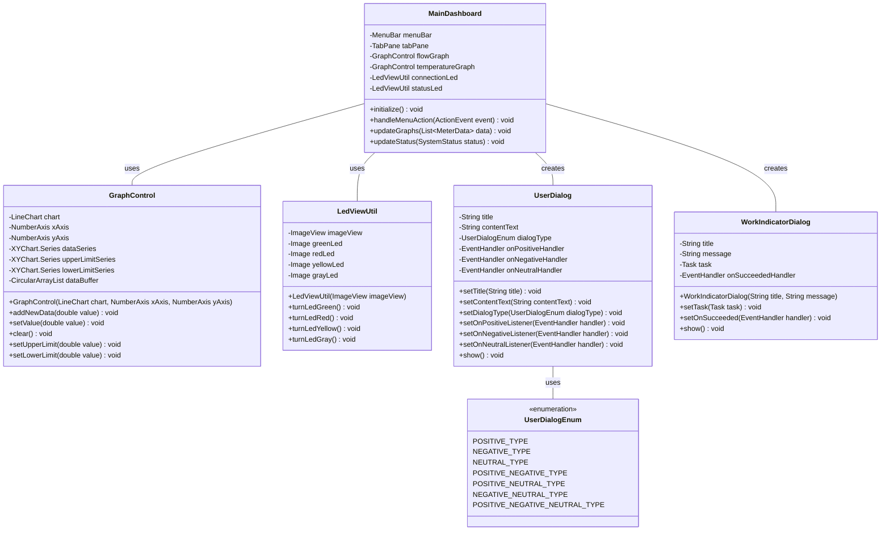
```mermaid
classDiagram
    class MainDashboard {
        -MenuBar menuBar
        -TabPane tabPane
        -GraphControl flowGraph
        -GraphControl temperatureGraph
        -LedViewUtil connectionLed
        -LedViewUtil statusLed
        +initialize() void
        +handleMenuAction(ActionEvent event) void
        +updateGraphs(List~MeterData~ data) void
        +updateStatus(SystemStatus status) void
    }
    
    class GraphControl {
        -LineChart chart
        -NumberAxis xAxis
        -NumberAxis yAxis
        -XYChart.Series dataSeries
        -XYChart.Series upperLimitSeries
        -XYChart.Series lowerLimitSeries
        -CircularArrayList<Double> dataBuffer
        +GraphControl(LineChart chart, NumberAxis xAxis, NumberAxis yAxis)
        +addNewData(double value) void
        +setValue(double value) void
        +clear() void
        +setUpperLimit(double value) void
        +setLowerLimit(double value) void
    }
    
    class LedViewUtil {
        -ImageView imageView
        -Image greenLed
        -Image redLed
        -Image yellowLed
        -Image grayLed
        +LedViewUtil(ImageView imageView)
        +turnLedGreen() void
        +turnLedRed() void
        +turnLedYellow() void
        +turnLedGray() void
    }
    
    class UserDialog {
        -String title
        -String contentText
        -UserDialogEnum dialogType
        -EventHandler<ActionEvent> onPositiveHandler
        -EventHandler<ActionEvent> onNegativeHandler
        -EventHandler<ActionEvent> onNeutralHandler
        +setTitle(String title) void
        +setContentText(String contentText) void
        +setDialogType(UserDialogEnum dialogType) void
        +setOnPositiveListener(EventHandler<ActionEvent> handler) void
        +setOnNegativeListener(EventHandler<ActionEvent> handler) void
        +setOnNeutralListener(EventHandler<ActionEvent> handler) void
        +show() void
    }
    
    class WorkIndicatorDialog {
        -String title
        -String message
        -Task task
        -EventHandler<WorkerStateEvent> onSucceededHandler
        +WorkIndicatorDialog(String title, String message)
        +setTask(Task task) void
        +setOnSucceeded(EventHandler<WorkerStateEvent> handler) void
        +show() void
    }
    
    class UserDialogEnum {
        <<enumeration>>
        POSITIVE_TYPE
        NEGATIVE_TYPE
        NEUTRAL_TYPE
        POSITIVE_NEGATIVE_TYPE
        POSITIVE_NEUTRAL_TYPE
        NEGATIVE_NEUTRAL_TYPE
        POSITIVE_NEGATIVE_NEUTRAL_TYPE
    }
    
    MainDashboard -- GraphControl : uses
    MainDashboard -- LedViewUtil : uses
    MainDashboard -- UserDialog : creates
    MainDashboard -- WorkIndicatorDialog : creates
    UserDialog -- UserDialogEnum : uses
```

### 3.7 Model Class Diagram

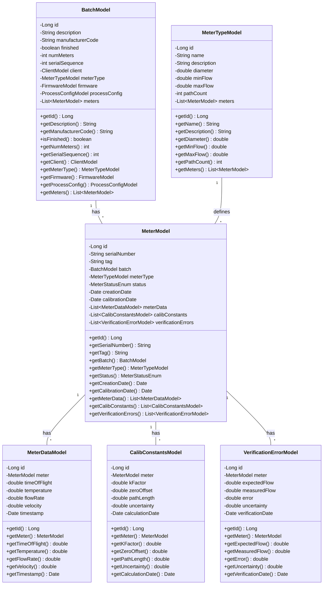
```mermaid
classDiagram
    class BatchModel {
        -Long id
        -String description
        -String manufacturerCode
        -boolean finished
        -int numMeters
        -int serialSequence
        -ClientModel client
        -MeterTypeModel meterType
        -FirmwareModel firmware
        -ProcessConfigModel processConfig
        -List~MeterModel~ meters
        +getId() Long
        +getDescription() String
        +getManufacturerCode() String
        +isFinished() boolean
        +getNumMeters() int
        +getSerialSequence() int
        +getClient() ClientModel
        +getMeterType() MeterTypeModel
        +getFirmware() FirmwareModel
        +getProcessConfig() ProcessConfigModel
        +getMeters() List~MeterModel~
    }
    
    class MeterModel {
        -Long id
        -String serialNumber
        -String tag
        -BatchModel batch
        -MeterTypeModel meterType
        -MeterStatusEnum status
        -Date creationDate
        -Date calibrationDate
        -List~MeterDataModel~ meterData
        -List~CalibConstantsModel~ calibConstants
        -List~VerificationErrorModel~ verificationErrors
        +getId() Long
        +getSerialNumber() String
        +getTag() String
        +getBatch() BatchModel
        +getMeterType() MeterTypeModel
        +getStatus() MeterStatusEnum
        +getCreationDate() Date
        +getCalibrationDate() Date
        +getMeterData() List~MeterDataModel~
        +getCalibConstants() List~CalibConstantsModel~
        +getVerificationErrors() List~VerificationErrorModel~
    }
    
    class MeterTypeModel {
        -Long id
        -String name
        -String description
        -double diameter
        -double minFlow
        -double maxFlow
        -int pathCount
        -List~MeterModel~ meters
        +getId() Long
        +getName() String
        +getDescription() String
        +getDiameter() double
        +getMinFlow() double
        +getMaxFlow() double
        +getPathCount() int
        +getMeters() List~MeterModel~
    }
    
    class MeterDataModel {
        -Long id
        -MeterModel meter
        -double timeOfFlight
        -double temperature
        -double flowRate
        -double velocity
        -Date timestamp
        +getId() Long
        +getMeter() MeterModel
        +getTimeOfFlight() double
        +getTemperature() double
        +getFlowRate() double
        +getVelocity() double
        +getTimestamp() Date
    }
    
    class CalibConstantsModel {
        -Long id
        -MeterModel meter
        -double kFactor
        -double zeroOffset
        -double pathLength
        -double uncertainty
        -Date calculationDate
        +getId() Long
        +getMeter() MeterModel
        +getKFactor() double
        +getZeroOffset() double
        +getPathLength() double
        +getUncertainty() double
        +getCalculationDate() Date
    }
    
    class VerificationErrorModel {
        -Long id
        -MeterModel meter
        -double expectedFlow
        -double measuredFlow
        -double error
        -double uncertainty
        -Date verificationDate
        +getId() Long
        +getMeter() MeterModel
        +getExpectedFlow() double
        +getMeasuredFlow() double
        +getError() double
        +getUncertainty() double
        +getVerificationDate() Date
    }
    
    BatchModel "1" -- "*" MeterModel : has
    MeterTypeModel "1" -- "*" MeterModel : defines
    MeterModel "1" -- "*" MeterDataModel : has
    MeterModel "1" -- "*" CalibConstantsModel : has
    MeterModel "1" -- "*" VerificationErrorModel : has
```

## 4. Thread Diagrams

### 4.1 Thread Model for UI and Socket Communication

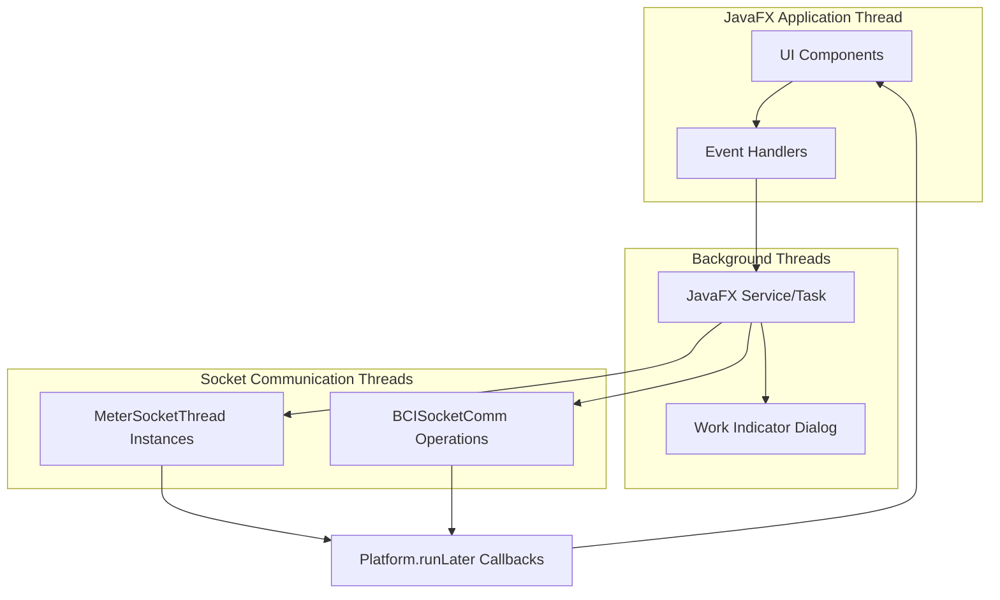
```mermaid
graph TD
    subgraph "JavaFX Application Thread"
        UI[UI Components]
        ControllerEvent[Event Handlers]
    end
    
    subgraph "Background Threads"
        Service[JavaFX Service/Task]
        WorkIndicator[Work Indicator Dialog]
    end
    
    subgraph "Socket Communication Threads"
        MeterThreads[MeterSocketThread Instances]
        BCIThread[BCISocketComm Operations]
    end
    
    UI --> ControllerEvent
    ControllerEvent --> Service
    Service --> WorkIndicator
    Service --> MeterThreads
    Service --> BCIThread
    MeterThreads --> CallbackThread[Platform.runLater Callbacks]
    BCIThread --> CallbackThread
    CallbackThread --> UI
```

### 4.2 Thread Lifecycle for Meter Communication

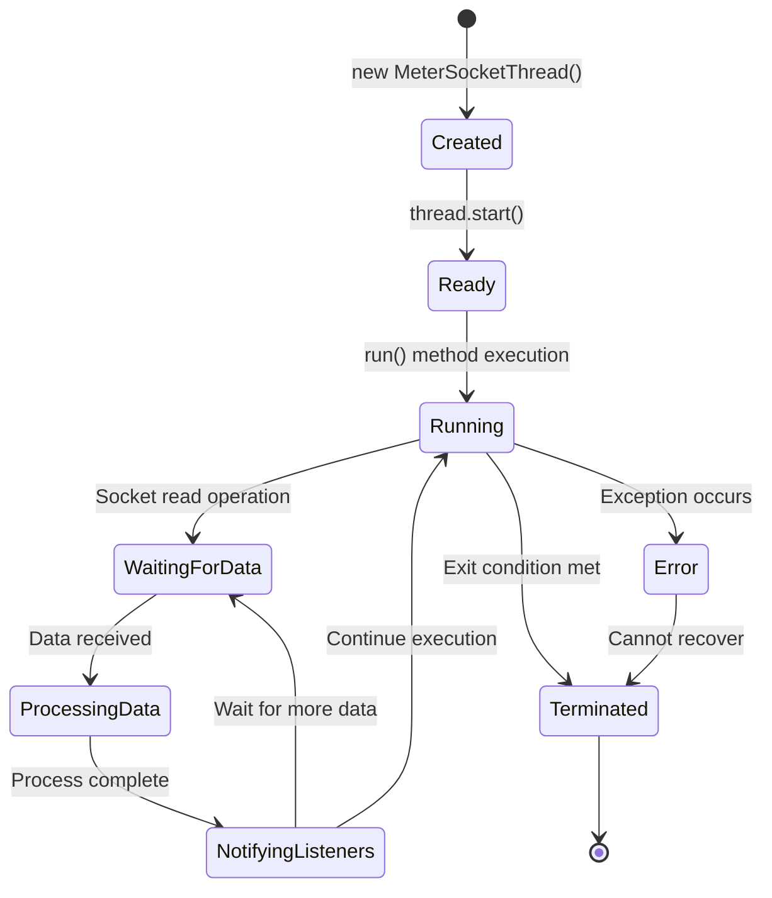
```mermaid
stateDiagram-v2
    [*] --> Created: new MeterSocketThread()
    Created --> Ready: thread.start()
    Ready --> Running: run() method execution
    Running --> WaitingForData: Socket read operation
    WaitingForData --> ProcessingData: Data received
    ProcessingData --> NotifyingListeners: Process complete
    NotifyingListeners --> WaitingForData: Wait for more data
    NotifyingListeners --> Running: Continue execution
    Running --> Terminated: Exit condition met
    Running --> Error: Exception occurs
    Error --> Terminated: Cannot recover
    Terminated --> [*]
```

## 5. Timing Diagrams

### 5.1 Socket Communication Timing Diagram

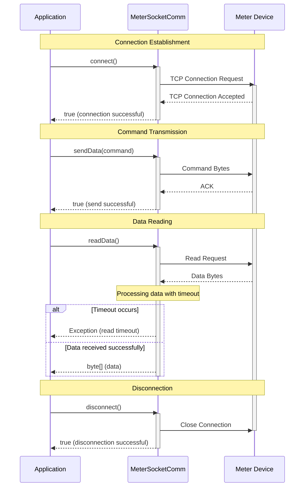
```mermaid
sequenceDiagram
    participant App as Application
    participant MSocket as MeterSocketComm
    participant Meter as Meter Device
    
    Note over App,Meter: Connection Establishment
    App->>MSocket: connect()
    activate MSocket
    MSocket->>Meter: TCP Connection Request
    activate Meter
    Meter-->>MSocket: TCP Connection Accepted
    MSocket-->>App: true (connection successful)
    deactivate MSocket
    
    Note over App,Meter: Command Transmission
    App->>MSocket: sendData(command)
    activate MSocket
    MSocket->>Meter: Command Bytes
    Meter-->>MSocket: ACK
    MSocket-->>App: true (send successful)
    deactivate MSocket
    
    Note over App,Meter: Data Reading
    App->>MSocket: readData()
    activate MSocket
    MSocket->>Meter: Read Request
    Meter-->>MSocket: Data Bytes
    
    Note over MSocket: Processing data with timeout
    alt Timeout occurs
        MSocket-->>App: Exception (read timeout)
    else Data received successfully
        MSocket-->>App: byte[] (data)
    end
    deactivate MSocket
    
    Note over App,Meter: Disconnection
    App->>MSocket: disconnect()
    activate MSocket
    MSocket->>Meter: Close Connection
    deactivate Meter
    MSocket-->>App: true (disconnection successful)
    deactivate MSocket
```

### 5.2 BCI Communication Timing Diagram

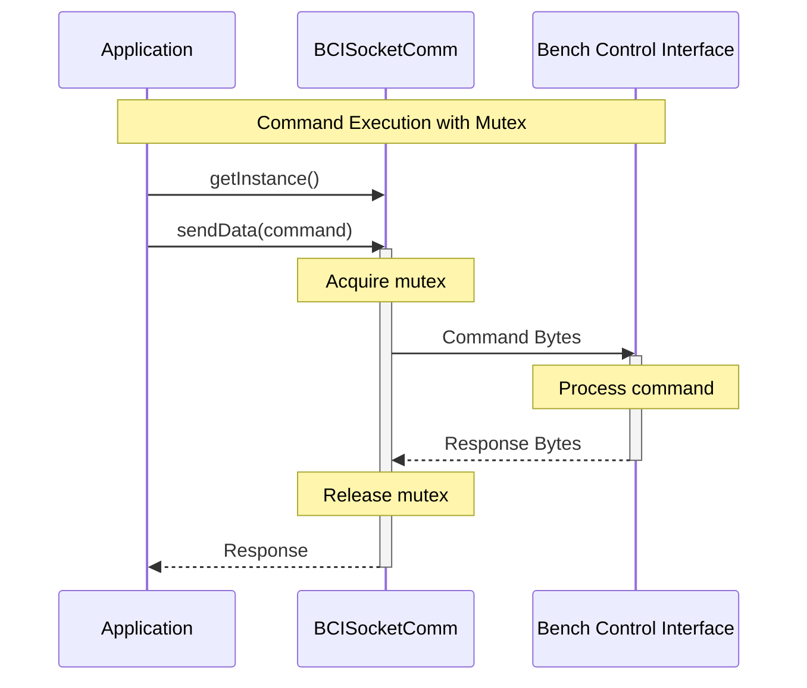
```mermaid
sequenceDiagram
    participant App as Application
    participant BCI as BCISocketComm
    participant Bench as Bench Control Interface
    
    Note over App,Bench: Command Execution with Mutex
    App->>BCI: getInstance()
    App->>BCI: sendData(command)
    activate BCI
    
    Note over BCI: Acquire mutex
    BCI->>Bench: Command Bytes
    activate Bench
    
    Note over Bench: Process command
    Bench-->>BCI: Response Bytes
    deactivate Bench
    
    Note over BCI: Release mutex
    BCI-->>App: Response
    deactivate BCI
```

## 6. Process Flow Diagrams

### 6.1 Calibration Process Sequence Diagram

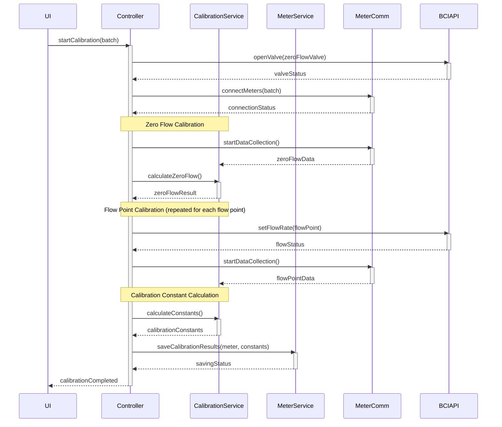
```mermaid
sequenceDiagram
    participant UI as UI
    participant Ctrl as Controller
    participant CS as CalibrationService
    participant MS as MeterService
    participant MC as MeterComm
    participant BCI as BCIAPI
    
    UI->>Ctrl: startCalibration(batch)
    activate Ctrl
    
    Ctrl->>BCI: openValve(zeroFlowValve)
    activate BCI
    BCI-->>Ctrl: valveStatus
    deactivate BCI
    
    Ctrl->>MC: connectMeters(batch)
    activate MC
    MC-->>Ctrl: connectionStatus
    deactivate MC
    
    Note over Ctrl,CS: Zero Flow Calibration
    Ctrl->>MC: startDataCollection()
    activate MC
    MC-->>CS: zeroFlowData
    deactivate MC
    
    Ctrl->>CS: calculateZeroFlow()
    activate CS
    CS-->>Ctrl: zeroFlowResult
    deactivate CS
    
    Note over Ctrl,CS: Flow Point Calibration (repeated for each flow point)
    Ctrl->>BCI: setFlowRate(flowPoint)
    activate BCI
    BCI-->>Ctrl: flowStatus
    deactivate BCI
    
    Ctrl->>MC: startDataCollection()
    activate MC
    MC-->>CS: flowPointData
    deactivate MC
    
    Note over Ctrl,CS: Calibration Constant Calculation
    Ctrl->>CS: calculateConstants()
    activate CS
    CS-->>Ctrl: calibrationConstants
    deactivate CS
    
    Ctrl->>MS: saveCalibrationResults(meter, constants)
    activate MS
    MS-->>Ctrl: savingStatus
    deactivate MS
    
    Ctrl-->>UI: calibrationCompleted
    deactivate Ctrl
```

### 6.2 Meter Communication State Diagram

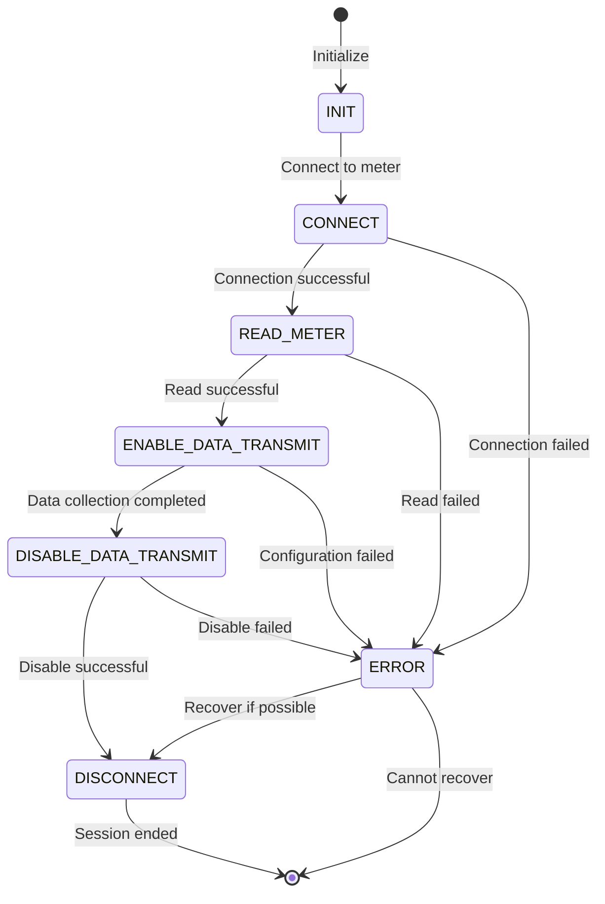
```mermaid
stateDiagram-v2
    [*] --> INIT: Initialize
    INIT --> CONNECT: Connect to meter
    CONNECT --> READ_METER: Connection successful
    CONNECT --> ERROR: Connection failed
    READ_METER --> ENABLE_DATA_TRANSMIT: Read successful
    READ_METER --> ERROR: Read failed
    ENABLE_DATA_TRANSMIT --> DISABLE_DATA_TRANSMIT: Data collection completed
    ENABLE_DATA_TRANSMIT --> ERROR: Configuration failed
    DISABLE_DATA_TRANSMIT --> DISCONNECT: Disable successful
    DISABLE_DATA_TRANSMIT --> ERROR: Disable failed
    DISCONNECT --> [*]: Session ended
    ERROR --> DISCONNECT: Recover if possible
    ERROR --> [*]: Cannot recover
```

## 7. Database Entity Relationship Diagram

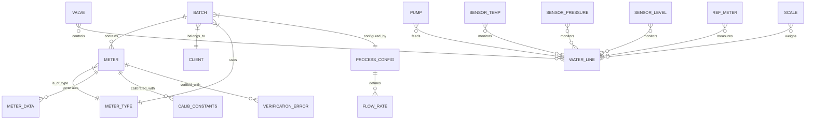
```mermaid
erDiagram
    BATCH ||--o{ METER : contains
    BATCH }|--|| CLIENT : belongs_to
    BATCH }|--|| METER_TYPE : uses
    BATCH }|--|| PROCESS_CONFIG : configured_by
    
    METER }|--|| METER_TYPE : is_of_type
    METER ||--o{ METER_DATA : generates
    METER ||--o{ CALIB_CONSTANTS : calibrated_with
    METER ||--o{ VERIFICATION_ERROR : verified_with
    
    PROCESS_CONFIG ||--o{ FLOW_RATE : defines
    
    VALVE }o--o{ WATER_LINE : controls
    PUMP }o--o{ WATER_LINE : feeds
    
    SENSOR_TEMP }o--o{ WATER_LINE : monitors
    SENSOR_PRESSURE }o--o{ WATER_LINE : monitors
    SENSOR_LEVEL }o--o{ WATER_LINE : monitors
    
    REF_METER }o--o{ WATER_LINE : measures
    SCALE }o--o{ WATER_LINE : weighs
```

## 8. UI Component Hierarchy

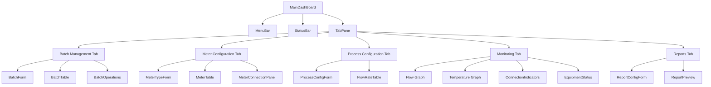
```mermaid
graph TD
    MainDashBoard --> MenuBar
    MainDashBoard --> StatusBar
    MainDashBoard --> TabPane
    
    TabPane --> BatchTab[Batch Management Tab]
    TabPane --> MeterTab[Meter Configuration Tab]
    TabPane --> ProcessTab[Process Configuration Tab]
    TabPane --> MonitorTab[Monitoring Tab]
    TabPane --> ReportTab[Reports Tab]
    
    BatchTab --> BatchForm
    BatchTab --> BatchTable
    BatchTab --> BatchOperations
    
    MeterTab --> MeterTypeForm
    MeterTab --> MeterTable
    MeterTab --> MeterConnectionPanel
    
    ProcessTab --> ProcessConfigForm
    ProcessTab --> FlowRateTable
    
    MonitorTab --> GraphControl[Flow Graph]
    MonitorTab --> GraphControl2[Temperature Graph]
    MonitorTab --> ConnectionIndicators
    MonitorTab --> EquipmentStatus
    
    ReportTab --> ReportConfigForm
    ReportTab --> ReportPreview
```

## 9. Complete System State Diagram

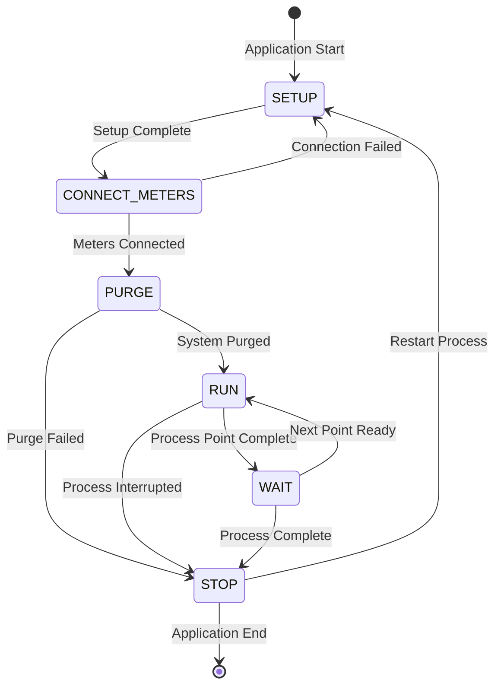
```mermaid
stateDiagram-v2
    [*] --> SETUP: Application Start
    SETUP --> CONNECT_METERS: Setup Complete
    CONNECT_METERS --> PURGE: Meters Connected
    CONNECT_METERS --> SETUP: Connection Failed
    PURGE --> RUN: System Purged
    PURGE --> STOP: Purge Failed
    RUN --> WAIT: Process Point Complete
    RUN --> STOP: Process Interrupted
    WAIT --> RUN: Next Point Ready
    WAIT --> STOP: Process Complete
    STOP --> [*]: Application End
    STOP --> SETUP: Restart Process
```

## 10. Socket Communication Protocol Diagram

```mermaid
graph TD
    subgraph "Socket Protocol Stack"
        TCP[TCP/IP Socket]
        Protocol[Application Protocol Layer]
        Commands[Command Processing Layer]
        API[API Abstraction Layer]
    end
    
    TCP --> Protocol
    Protocol --> Commands
    Commands --> API
    
    subgraph "Data Flow"
        Command[Command Creation]
        Serialization[Byte Serialization]
        Transmission[Socket Transmission]
        Reception[Data Reception]
        Parsing[Response Parsing]
        Callback[Result Callback]
    end
    
    Command --> Serialization
    Serialization --> Transmission
    Transmission --> Reception
    Reception --> Parsing
    Parsing --> Callback
```

I hope these comprehensive diagrams help you understand the structure and behavior of the codebase. They cover:

1. High-level architecture
2. Module relationships
3. Detailed class diagrams for each module
4. Thread models and lifecycle
5. Communication timing sequences
6. Process flows for key business operations
7. Database entity relationships
8. UI component hierarchy
9. System state management
10. Socket communication protocol

These diagrams should provide a solid foundation for understanding this complex industrial flow measurement system. If you need any specific diagram clarified or additional details, please let me know.
